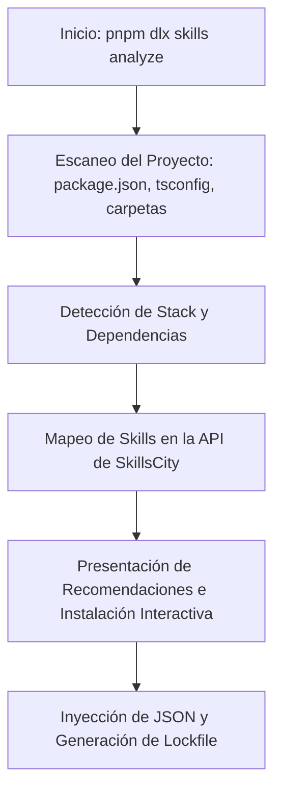

# Guía de Implementación para el CLI de SkillsCity

Esta guía detalla la arquitectura, dependencias y estructura de código necesaria para construir un CLI real capaz de replicar el funcionamiento de `pnpm dlx skills analyze` y `skills add`.

---

## 1. Arquitectura de la CLI

El flujo de ejecución de la herramienta se divide en cuatro fases principales:



---

## 2. Dependencias del Proyecto CLI

Para construir la herramienta en Node.js con TypeScript, se recomiendan los siguientes paquetes npm:

```json
{
  "dependencies": {
    "@clack/prompts": "^0.7.0",
    "commander": "^11.1.0",
    "fast-glob": "^3.3.2",
    "fs-extra": "^11.2.0",
    "picocolors": "^1.0.0",
    "semver": "^7.5.4"
  },
  "devDependencies": {
    "@types/fs-extra": "^11.0.4",
    "@types/node": "^20.10.0",
    "typescript": "^5.3.2"
  }
}
```

- **`commander`**: Manejo de argumentos y subcomandos (`analyze`, `add`).
- **`@clack/prompts`**: UI de consola interactiva y moderna (cuestionarios, animaciones, loaders).
- **`fast-glob`** y **`fs-extra`**: Lectura y escritura rápida en el sistema de archivos local.
- **`picocolors`**: Colores limpios en terminal sin sobrecarga.

---

## 3. Estructura de Archivos del Proyecto CLI

```text
skills-cli/
├── src/
│   ├── commands/
│   │   ├── analyze.ts       # Código del comando de escaneo
│   │   └── add.ts           # Código de inyección y cuestionario
│   ├── utils/
│   │   ├── detector.ts      # Funciones para detectar frameworks y lenguajes
│   │   └── filesystem.ts    # Operaciones del disco local
│   └── index.ts             # Punto de entrada de la CLI
├── package.json
└── tsconfig.json
```

---

## 4. Detección Inteligente de Múltiples Lenguajes (Motor de Reglas)

Para dar soporte a un número considerable de lenguajes y frameworks de forma mantenible y extensible, la CLI implementa un **motor de reglas de escaneo**. Esto permite mapear cualquier lenguaje nuevo simplemente declarando su configuración de archivos manifiestos y extensiones comunes:

```typescript
export interface LanguageRule {
  language: string;
  manifests: string[];
  extensions: string[];
  frameworkRules?: Array<{
    framework: string;
    manifestIndicator?: string; // Dependencia que indica el framework
  }>;
}

export const LANGUAGE_RULES: LanguageRule[] = [
  {
    language: 'TypeScript',
    manifests: ['tsconfig.json'],
    extensions: ['.ts', '.tsx'],
    frameworkRules: [
      { framework: 'Next.js', manifestIndicator: 'next' },
      { framework: 'Vite', manifestIndicator: 'vite' },
      { framework: 'React', manifestIndicator: 'react' }
    ]
  },
  {
    language: 'JavaScript',
    manifests: ['package.json', 'jsconfig.json', 'deno.json'],
    extensions: ['.js', '.jsx', '.mjs', '.cjs'],
    frameworkRules: [
      { framework: 'Express', manifestIndicator: 'express' },
      { framework: 'React', manifestIndicator: 'react' }
    ]
  },
  {
    language: 'Python',
    manifests: ['requirements.txt', 'pyproject.toml', 'Pipfile', 'conda.yaml'],
    extensions: ['.py'],
    frameworkRules: [
      { framework: 'FastAPI', manifestIndicator: 'fastapi' },
      { framework: 'Django', manifestIndicator: 'django' },
      { framework: 'Flask', manifestIndicator: 'flask' }
    ]
  },
  {
    language: 'Rust',
    manifests: ['Cargo.toml'],
    extensions: ['.rs'],
    frameworkRules: [
      { framework: 'Actix-Web', manifestIndicator: 'actix-web' },
      { framework: 'Axum', manifestIndicator: 'axum' },
      { framework: 'Tauri', manifestIndicator: 'tauri' }
    ]
  },
  {
    language: 'Go',
    manifests: ['go.mod'],
    extensions: ['.go'],
    frameworkRules: [
      { framework: 'Gin', manifestIndicator: 'github.com/gin-gonic/gin' },
      { framework: 'Fiber', manifestIndicator: 'github.com/gofiber/fiber' }
    ]
  },
  {
    language: 'Java',
    manifests: ['pom.xml', 'build.gradle', 'build.gradle.kts'],
    extensions: ['.java', '.kt'],
    frameworkRules: [
      { framework: 'Spring Boot', manifestIndicator: 'spring-boot' }
    ]
  },
  {
    language: 'PHP',
    manifests: ['composer.json'],
    extensions: ['.php'],
    frameworkRules: [
      { framework: 'Laravel', manifestIndicator: 'laravel/framework' },
      { framework: 'Symfony', manifestIndicator: 'symfony/symfony' }
    ]
  },
  {
    language: 'Ruby',
    manifests: ['Gemfile'],
    extensions: ['.rb'],
    frameworkRules: [
      { framework: 'Ruby on Rails', manifestIndicator: 'rails' }
    ]
  }
];
```

---

## 5. Implementación del Detector de Stack (`src/utils/detector.ts`)

Este módulo examina el sistema de archivos del usuario aplicando el motor de reglas definido anteriormente:

```typescript
import fs from 'fs-extra';
import path from 'path';
import { LANGUAGE_RULES } from './rules'; // Importa la lista de reglas

export interface ProjectStack {
  languages: string[];
  frameworks: string[];
  dependencies: string[];
  hasGit: boolean;
}

export async function detectStack(projectPath: string): Promise<ProjectStack> {
  const stack: ProjectStack = {
    languages: [],
    frameworks: [],
    dependencies: [],
    hasGit: false
  };

  // 1. Detectar Git local
  stack.hasGit = await fs.pathExists(path.join(projectPath, '.git'));

  // 2. Leer archivos en la raíz del proyecto para evaluar extensiones
  const rootFiles = await fs.pathExists(projectPath) ? await fs.readdir(projectPath) : [];
  const hasExtension = (ext: string) => rootFiles.some(f => f.endsWith(ext));

  for (const rule of LANGUAGE_RULES) {
    let matchesLanguage = false;

    // A. Buscar archivos de configuración/manifiestos
    for (const manifest of rule.manifests) {
      const manifestPath = path.join(projectPath, manifest);
      if (await fs.pathExists(manifestPath)) {
        matchesLanguage = true;

        // Extraer dependencias específicas de cada ecosistema
        if (manifest === 'package.json') {
          try {
            const pkg = await fs.readJson(manifestPath);
            const deps = [
              ...Object.keys(pkg.dependencies || {}),
              ...Object.keys(pkg.devDependencies || {})
            ];
            stack.dependencies.push(...deps);

            // Evaluar frameworks de JS/TS
            if (rule.frameworkRules) {
              for (const fw of rule.frameworkRules) {
                if (fw.manifestIndicator && deps.includes(fw.manifestIndicator)) {
                  stack.frameworks.push(fw.framework);
                }
              }
            }
          } catch (e) {}
        }

        if (manifest === 'requirements.txt') {
          try {
            const content = await fs.readFile(manifestPath, 'utf-8');
            const deps = content.split('\n')
              .map(line => line.split('==')[0].trim())
              .filter(line => line.length > 0 && !line.startsWith('#'));
            stack.dependencies.push(...deps);

            if (rule.frameworkRules) {
              for (const fw of rule.frameworkRules) {
                if (fw.manifestIndicator && deps.some(d => d.toLowerCase().includes(fw.manifestIndicator!))) {
                  stack.frameworks.push(fw.framework);
                }
              }
            }
          } catch (e) {}
        }

        if (manifest === 'Cargo.toml') {
          try {
            const content = await fs.readFile(manifestPath, 'utf-8');
            const lines = content.split('\n');
            for (const line of lines) {
              if (line.includes('=')) {
                const dep = line.split('=')[0].trim();
                stack.dependencies.push(dep);
                if (rule.frameworkRules) {
                  for (const fw of rule.frameworkRules) {
                    if (fw.manifestIndicator && dep === fw.manifestIndicator) {
                      stack.frameworks.push(fw.framework);
                    }
                  }
                }
              }
            }
          } catch (e) {}
        }
      }
    }

    // B. Evaluar por extensión de archivos como alternativa
    if (!matchesLanguage) {
      for (const ext of rule.extensions) {
        if (hasExtension(ext)) {
          matchesLanguage = true;
          break;
        }
      }
    }

    if (matchesLanguage) {
      stack.languages.push(rule.language);
    }
  }

  // De-duplicar arrays
  stack.languages = [...new Set(stack.languages)];
  stack.frameworks = [...new Set(stack.frameworks)];
  stack.dependencies = [...new Set(stack.dependencies)];

  return stack;
}
```

---

## 5. Implementación del Escáner (`src/commands/analyze.ts`)

Coordina el escaneo del stack y recomienda paquetes de habilidades:

```typescript
import { intro, outro, spinner, note } from '@clack/prompts';
import pc from 'picocolors';
import { detectStack } from '../utils/detector';

export async function analyzeCommand() {
  intro(pc.black(pc.bgWhite(' SKILLS ANALYZER ')));

  const s = spinner();
  s.start('Escaneando la estructura de tu proyecto local...');
  
  const stack = await detectStack(process.cwd());
  await new Promise(resolve => setTimeout(resolve, 1200)); // Simulación de carga
  
  s.stop('Escaneo completado');

  // Lógica de recomendación de paquetes
  const recommendations: string[] = [];
  if (stack.frameworks.includes('Next.js')) {
    recommendations.push('fullstack-workflow-package (Automatiza Next.js y Git)');
  }
  if (stack.dependencies.includes('@supabase/supabase-js')) {
    recommendations.push('supabase-vector-sync (Mapea colecciones vectoriales)');
  }
  if (stack.hasGit) {
    recommendations.push('github-assistant (Optimiza flujo de commits locales)');
  }

  let summary = `Stack Detectado:
- Lenguajes: ${stack.languages.join(', ') || 'Desconocidos'}
- Frameworks: ${stack.frameworks.join(', ') || 'Ninguno'}
- Git Activo: ${stack.hasGit ? 'Si' : 'No'}`;

  note(summary, 'Resumen del Proyecto');

  if (recommendations.length > 0) {
    const list = recommendations.map((rec, i) => `${i + 1}. ${rec}`).join('\n');
    note(list, 'Habilidades recomendadas para tu stack');
  } else {
    note('No se hallaron recomendaciones automáticas específicas. Visita el directorio de SkillsCity.', 'Recomendación');
  }

  outro(`Ejecuta ${pc.bold('pnpm dlx skills add <nombre-skill>')} para instalar una habilidad.`);
}
```

---

## 6. Generación del Cuestionario e Inyección (`src/commands/add.ts`)

Lee el archivo de definición de la skill, genera las preguntas necesarias, reemplaza los parámetros e inyecta la configuración personalizada:

```typescript
import { intro, outro, text, select, confirm, spinner } from '@clack/prompts';
import fs from 'fs-extra';
import path from 'path';
import pc from 'picocolors';

interface SkillDefinition {
  name: string;
  version: string;
  description: string;
  interactiveQuestions?: Array<{
    name: string;
    message: string;
    type: 'text' | 'confirm';
    default?: string;
  }>;
  promptTemplate: string;
}

export async function addCommand(skillName: string) {
  intro(pc.black(pc.bgWhite(` INSTALAR SKILL: ${skillName} `)));

  const s = spinner();
  s.start(`Descargando definición de la skill: ${skillName}...`);
  
  // En producción, aquí se consulta la API de la base de datos de SkillsCity
  // Para demostración, usamos una plantilla simulada
  await new Promise(resolve => setTimeout(resolve, 1000));
  
  const skillDef: SkillDefinition = {
    name: skillName,
    version: '1.0.0',
    description: 'Automatización y auditoría de repositorio local',
    interactiveQuestions: [
      {
        name: 'targetBranch',
        message: '¿Cuál es el nombre de la rama destino principal?',
        type: 'text',
        default: 'main'
      },
      {
        name: 'outputPath',
        message: '¿En qué ruta local deseas almacenar el prompt del agente?',
        type: 'text',
        default: './src/agents'
      }
    ],
    promptTemplate: 'Eres un agente experto configurado en la rama {{targetBranch}}. Trabajarás en el directorio {{outputPath}}.'
  };

  s.stop('Definición obtenida');

  // Ejecución interactiva de preguntas
  const answers: Record<string, any> = {};
  if (skillDef.interactiveQuestions) {
    for (const q of skillDef.interactiveQuestions) {
      if (q.type === 'text') {
        answers[q.name] = await text({
          message: q.message,
          placeholder: q.default,
          defaultValue: q.default
        });
      }
    }
  }

  s.start('Inyectando prompts y configurando dependencias locales...');
  await new Promise(resolve => setTimeout(resolve, 1000));

  // Reemplazar placeholders en la plantilla del prompt
  let finalPrompt = skillDef.promptTemplate;
  for (const [key, val] of Object.entries(answers)) {
    finalPrompt = finalPrompt.replace(new RegExp(`{{${key}}}`, 'g'), String(val));
  }

  // Escribir el archivo inyectado final en el proyecto del usuario
  const outDir = path.resolve(answers.outputPath || './src/agents');
  await fs.ensureDir(outDir);
  await fs.writeJson(path.join(outDir, `${skillDef.name}.json`), {
    name: skillDef.name,
    version: skillDef.version,
    configuredPrompt: finalPrompt,
    installationDetails: {
      timestamp: new Date().toISOString(),
      parameters: answers
    }
  }, { spaces: 2 });

  s.stop('Inyección completada con éxito');

  outro(`La skill ha sido guardada en: ${pc.cyan(path.join(outDir, `${skillDef.name}.json`))}`);
}
```
